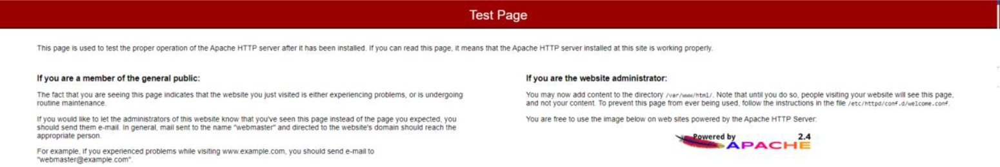

# CREATION DU LOAD-BALANCER

Dans une architecture, un load-balancer est un équipement qui permet de recevoir le traffic entrant pour le distribuer vers un ou plusieurs serveurs. Un load-balancer dispose de nombreuses fonctionnalités comme :

- L’équilibrage de charge entre les serveurs
- La redirection de port
- Encapsulation / décapsulation HTTPS

Dans le cadre de ce lab, le load-balancer de votre infrastructure est chargé d’accueillir le traffic HTTP de votre application et le distribuer vers votre serveur web pour traitement.

## Déclaration du load-balancer

Dans terraform, un load-balancer AWS se déclare au travers d’une ressource **aws_lb**.

En vous appuyant sur la [documentation officielle de terraform](https://registry.terraform.io/providers/hashicorp/aws/latest/docs/resources/lb), déclarez votre load-balancer dans un fichier nommé **load_balancer.tf** avec les caractéristiques suivantes :

| Caractéristique | Valeur                                                                     |
|-----------------|----------------------------------------------------------------------------|
| Nom             | Le nom de votre load-balancer (utilisez la variable locale correspondante) |
| Interne ?       | Non                                                                        |
| Type            | applicatif                                                                 |
| Security group  | Le security group correspondant précédemment créé                          |
| Sous-réseaux    | Les 2 sous-réseaux publics (utilisez les datasources correspondantes)      |

## Déclaration du target group

Sur AWS, un load-balancer distribue le traffic entrant vers une ressource appelée « target group ». Un target group est caractérisé par :

- Un type de targets (serveurs, adresses IPs, load-balancers, etc…)
- Le protocole à utiliser par le load-balancer pour y distribuer le traffic
- Le port à utiliser par le load-balancer pour y distribuer le traffic

C’est dans le target group que sont configurées les règles de healthcheck que le load-balancer applique pour connaître la disponibilité de ses targets.

Enfin, un load-balancer peut être rattaché à un ou plusieurs target groups.

Dans terraform, un target group se déclare au travers d’une ressource **aws_lb_target_group**.

En vous appuyant sur la [documentation officielle de terraform](https://registry.terraform.io/providers/hashicorp/aws/latest/docs/resources/lb_target_group), déclarez un target group dans votre fichier **load_balancer.tf** avec les caractéristiques suivantes :

| Caractéristique | Valeur                                                                                        |
|-----------------|-----------------------------------------------------------------------------------------------|
| Nom             | nuumfactory-\<environnement\>-tg-\<digit\> (vous pouvez créer une variable locale supplémentaire) |
| Port            | 80                                                                                                |
| Protocole       | HTTP                                                                                              |
| VPC             | Le VPC du lab, nuumfactory-vpc. Utilisez la datasource correspondante.                            |

## Déclaration des targets

Vous aurez noté que les cibles ne sont pas déclarées dans le target group. En effet sur AWS, un target group est un objet à part entière dans lequel nous pouvons enregistrer des cibles (target).

Dans terraform, l’enregistrement d’une target dans un target group s’effectue au travers de la ressource **aws_lb_target_group_attachment**.

En vous appuyant sur la [documentation officielle de terraform](https://registry.terraform.io/providers/hashicorp/aws/latest/docs/resources/lb_target_group_attachment), enregistrez votre serveur web dans le target group que vous avez précédemment déclaré (dans le fichier **load_balancer.tf**).

## Déclaration du listener

Un listener est un processus qui recherche les demandes de connexion effectuées sur le protocole et le port qui y sont configurés. Chaque listener contient une règle qui décrit comment le traffic reçu par le load-balancer doit être distribué aux target groups qui lui sont attachés.

Un load-balancer peut contenir un ou plusieurs listeners. Dans terraform, un listener se déclare au travers de la ressource **aws_lb_listener**.

En vous appuyant sur la [documentation officielle de terraform](https://registry.terraform.io/providers/hashicorp/aws/latest/docs/resources/lb_listener), déclarez dans votre fichier **load_balancer.tf** un listener dans votre fichier **main.tf** afin que votre load-balancer écoute le port **80** (protocole HTTP) et redistribue les requêtes qu’il y reçoit vers le target group que vous venez de déclarer.

*N.B : Les paramètres ssl_policy et certificate_arn ne sont pas à renseigner lorsque le protocole est HTTP.*

A ce stade, vous avez déclaré l’ensemble des éléments requis pour le bon fonctionnement de votre balancer :

- Le listener permet au load-balancer d’écouter le traffic HTTP entrant sur le port 80
- Le listener permet au load-balancer de distribuer le flux entrant à son target group
- Le serveur web étant enregistré dans le target group, il peut recevoir et traiter ce flux

## Création du load-balancer

Exécutez la commande **terraform fmt** puis la commande **terraform plan -var-file="developpement.tfvars"** : Corrigez les éventuelles erreurs obtenues et réexécutez la commande jusqu’à ne plus en obtenir.

Observez le plan d’exécution et s’il correspond à ce que vous souhaitez réaliser, exécutez la commande **terraform apply -auto-approve -var-file="developpement.tfvars"**.

Terraform procède à la création de votre load-balancer et des ressources annexes déclarées.

## Test d'accès web

A ce stade, tous les éléments sont en place pour que vous puissiez accéder à la page d’accueil par défaut de votre serveur web :

- Connectez-vous à la console AWS, tapez Load balancers dans la barre de recherche et cliquez sur la feature Load balancers
- Identifiez et sélectionnez votre load-balancer, et observez sa description qui s’affiche en bas de page
- Copiez le DNS name affiché et accédez-y depuis votre navigateur favori

La page suivante devrait s’afficher :

Cela veut dire que votre requête a correctement été reçue par votre load-balancer, puis transmise à votre serveur web qui l’a ensuite traitée en vous retournant cette page web.